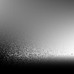
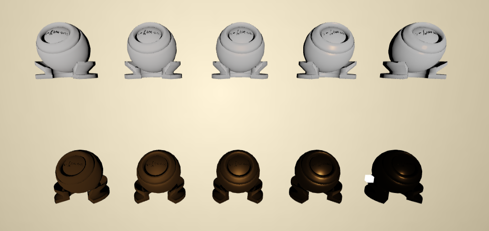

## 初步完成E_μ

E_μ的结果是一张二维表，以roughness和μ作为两个维度。

可以看到图片有很多噪声，这是因为低粗糙度的微表面材质接近镜面反射材质，即微表面的法线m(即半程向量h)集中分布在几何法线n附近，而我们由采样入射光方向i计算出的微表面法向量m分布并不会集中在几何法线n附近，也就是说这与实际低粗糙度的微表面法线分布相差很大，因此积分值的方差就会很大。

[代码在此](https://github.com/yindec/Kulla-Conty/commit/0de8a2eda82846cda44cce2b8e88971b2f06be75)

##  预计算E_avg

[ImportanceSampleGGX](https://learnopengl-cn.github.io/07%20PBR/03%20IBL/02%20Specular%20IBL/#hdr)

[代码在此](https://github.com/yindec/Kulla-Conty/commit/913d8a6958325f053206c2fd5c8be78b03ed24b6)

## 实时渲染

### 没有考虑能量损失

渲染结果

因为还没更改fms的结果，使得`BRDF=Fmicro + 1.0`;也就成了白色。

[代码在此](https://github.com/yindec/GAMES202/commit/78d88f59843d80e2d05d2a4c7818984262495505)

